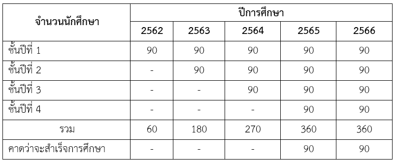
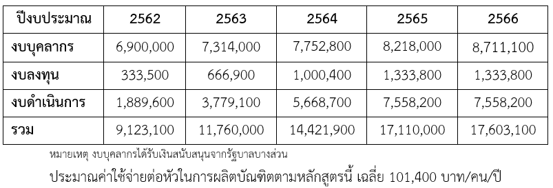

# หมวดที่ 3 ระบบการจัดการศึกษา การดําเนินการ และโครงสร้างของหลักสูตร

## 1. ระบบการจัดการศึกษา

### 1.1 ระบบ

ใช้ระบบการศึกษาแบบทวิภาคโดยใน 1 ปีการศึกษาแบ่งออกเป็น 2 ภาคการศึกษาปกติ ซึ่ง 1 ภาคการศึกษาปกติ มีระยะเวลาศึกษาไม่น้อยกว่า 15 สัปดาห์ และภาคการศึกษาพิเศษให้กำหนดระยะเวลาโดยสัดส่วนเทียบเคียงได้กับภาคการศึกษาปกติ

####	ข้อกำหนดต่าง ๆ 

เป็นไปตามข้อบังคับสถาบันเทคโนโลยีพระจอมเกล้าเจ้าคุณทหารลาดกระบังว่าด้วยการศึกษาระดับปริญญาตรี พ.ศ. 2559 (ภาคผนวก ก)

### 1.2 การจัดการศึกษาภาคการศึกษาพิเศษ

 มีภาคการศึกษาพิเศษ (วิชาฝึกงานภาคอุตสาหกรรม)

### 1.3 การเทียบเคียงหน่วยกิตในระบบทวิภาค

 มี เป็นไปตามข้อบังคับสถาบันเทคโนโลยีพระจอมเกล้าเจ้าคุณทหารลาดกระบัง ว่าด้วยการศึกษาระดับปริญญาตรี พ.ศ.2559 (ภาคผนวก ก) และประกาศสถาบันเทคโนโลยีพระจอมเกล้าเจ้าคุณทหารลาดกระบัง เรื่อง การลงทะเบียนข้ามสถาบันอุดมศึกษา (ภาคผนวก ค)

2. การดําเนินการหลักสูตร

### 2.1 วัน-เวลาในการดำเนินการเรียนการสอน

- [x] วัน – เวลาราชการ

- [x]  ภาคการศึกษาที่ 1 เดือน สิงหาคม – เดือน ธันวาคม

- [x]  ภาคการศึกษาที่ 2 เดือน มกราคม – เดือน พฤษภาคม

- [x]  ภาคการศึกษาพิเศษ เดือน มิถุนายน – เดือน กรกฎาคม

### 2.2 คุณสมบัติของผู้เข้าศึกษา

สำเร็จการศึกษาระดับมัธยมศึกษาตอนปลายหรือประกาศนียบัตรวิชาชีพ หรือเทียบเท่า หรือเทียบโอนมาจากสถาบันการศึกษาแห่งอื่น และผ่านการสอบคัดเลือกเข้าศึกษาตามเกณฑ์ของ สกอ. หรือผ่านการคัดเลือกจากระบบการคัดเลือกบุคคลเข้าศึกษาต่อในระดับมหาวิทยาลัย หรือตามข้อบังคับและประกาศของสถาบันฯ 

### 2.3 ปัญหาของนักศึกษาแรกเข้า

- [x]  ความรู้ด้านคณิตศาสตร์/วิทยาศาสตร์ไม่เพียงพอ

- [x]  การปรับตัวจากการเรียนในระดับมัธยมศึกษา

### 2.4 กลยุทธ์ในการดําเนินการเพื่อแก้ไขปัญหา / ข้อจํากัดของนักศึกษาในข้อ 2.3

- [x]  จัดสอนเสริมเตรียมความรู้พื้นฐานก่อนการเรียน

- [x]  จัดการปฐมนิเทศนักศึกษาใหม่ แนะนำการวางเป้าหมายชีวิต เทคนิคการเรียนในสถาบันและ การแบ่งเวลา
 
### 2.5 แผนการรับนักศึกษาและผูสําเร็จการศึกษาในระยะ 5 ปี 

### 2.6 งบประมาณตามแผน 

## 3. หลักสูตรและอาจารย์ผู้สอน

### 3.1 หลักสูตร

#### 3.1.1 จำนวนหน่วยกิตรวมตลอดหลักสูตร 	139 	หน่วยกิต

#### 3.1.2 โครงสร้างหลักสูตร
|||||
|--|-|---|---|
|ก. หมวดวิชาศึกษาทั่วไป	||30| 	หน่วยกิต|
|กลุ่มวิชาภาษาและการสื่อสาร	||12|	หน่วยกิต|
||		บังคับเรียน	|12	|หน่วยกิต|
|กลุ่มวิชาคุณค่าแห่งชีวิต||	6 	|หน่วยกิต|
||		บังคับเรียน|	3	|หน่วยกิต|
||		เลือกเรียน|	3	|หน่วยกิต|
|กลุ่มวิชาวิถีแห่งสังคม||	6 	|หน่วยกิต|
||		เลือกเรียน|	6 	|หน่วยกิต|
|กลุ่มวิชาศาสตร์แห่งการคิด||	3 	|หน่วยกิต|
||		เลือกเรียน|	3 	|หน่วยกิต|
|กลุ่มวิชาศิลปะแห่งการจัดการ||	3 	|หน่วยกิต|
||		เลือกเรียน|	3 	|หน่วยกิต|
ข. หมวดวิชาเฉพาะ	103 	หน่วยกิต
กลุ่มวิชาชีพครู	37 	หน่วยกิต
		วิชาชีพครูทั่วไป – บังคับเรียน	22 	หน่วยกิต
		วิชาชีพครูเฉพาะ– บังคับเรียน	15 	หน่วยกิต

กลุ่มวิชาชีพวิศวกรรม	66 	หน่วยกิต
		วิชาพื้นฐานวิศวกรรม	34 	หน่วยกิต
		วิชาชีพเฉพาะแขนงวิชา	32 	หน่วยกิต
		  บังคับเรียน	29 	หน่วยกิต
		  เลือกเรียน	3 	หน่วยกิต
		วิชาการฝึกงานอุตสาหกรรม	-  	หน่วยกิต
ค. หมวดวิชาเลือกเสรี	6 	หน่วยกิต
3.1.3 รายวิชา
ก. หมวดวิชาศึกษาทั่วไป	30 	หน่วยกิต
กลุ่มวิชาภาษาและการสื่อสาร	12 	หน่วยกิต
		บังคับเรียน	12 	หน่วยกิต
หน่วยกิต (บรรยาย-ปฏิบัติ-ศึกษาด้วยตนเอง)
90595001	ภาษาอังกฤษพื้นฐาน		3 (3-0-6)
	FOUNDATION ENGLISH
90595002	ภาษาอังกฤษเพื่อการสื่อสาร		3 (3-0-6)
		ENGLISH FOR COMMUNICATION
90595003	ภาษาอังกฤษเชิงวิชาการ		3 (3-0-6)
	ENGLISH FOR ACADEMIC PURPOSES
90595021	ภาษาไทยเพื่อการสร้างสรรค์		3 (3-0-6)
		THAI LANGUAGE FOR CREATIVITY
กลุ่มวิชาคุณค่าแห่งชีวิต	6 	หน่วยกิต
		บังคับเรียน	3 	หน่วยกิต
หน่วยกิต (บรรยาย-ปฏิบัติ-ศึกษาด้วยตนเอง)  
90591001	เรารัก สจล.		2 (1-2-3)
	I LOVE KMITL
90591002	กีฬาและนันทนาการ		1 (0-3-2)
	SPORTS AND RECREATIONAL ACTIVITIES
		เลือกเรียน*	3 	หน่วยกิต
กลุ่มวิชาวิถีแห่งสังคม	6 	หน่วยกิต
		เลือกเรียน*	6 	หน่วยกิต
กลุ่มวิชาศาสตร์แห่งการคิด	3 	หน่วยกิต
		เลือกเรียน*	3 	หน่วยกิต
กลุ่มวิชาศิลปะแห่งการจัดการ	3 	หน่วยกิต
		เลือกเรียน*	3 	หน่วยกิต
	วิชาในหมวดวิชาศึกษาทั่วไปนี้เป็นไปตามเล่มหลักสูตรหมวดวิชาศึกษาทั่วไป (ฉบับปรุง  พ.ศ. 2559) ของสถาบันเทคโนโลยีพระจอมเกล้าเจ้าคุณทหารลาดกระบัง ส่วนวิชาเลือกเรียน นักศึกษาสามารถเลือกเรียนตามรายวิชาที่สถาบันเทคโนโลยีพระจอมเกล้าเจ้าคุณทหารลาดกระบังเปิดสอน

ข. หมวดวิชาเฉพาะ	103 	หน่วยกิต
กลุ่มวิชาชีพครู	37 	หน่วยกิต
วิชาชีพครูทั่วไป – บังคับเรียน	22 	หน่วยกิต
		หน่วยกิต (บรรยาย-ปฏิบัติ-ศึกษาด้วยตนเอง)
03206041	หลักการศึกษาเพื่อพัฒนาอย่างยั่งยืน	3 (2-2-5)
		PRINCIPLES OF EDUCATION FOR SUSTAINABILITY 
		DEVELOPMENT
03206042	จิตวิญญาณความเป็นครู		3 (2-2-5)
		TEACHER SPIRITUALITY
03206043	จิตวิทยาการศึกษา		3 (2-2-5)
		EDUCATIONAL PSYCHOLOGY
03206044	วิธีวิทยาการจัดการเรียนรู้และการจัดการชั้นเรียน	4 (2-4-6)
		LEARNING METHODOLOGY AND CLASSROOM 
		MANAGEMENT
03206045	สื่อ นวัตกรรมและเทคโนโลยีสารสนเทศทางการศึกษา	3 (2-2-5)
		MEDIA, INNOVATION, AND INFORMATION TECHNOLOGY
		IN EDUCATION
03206046	การวิจัย การวัดประเมินผลการเรียนรู้เพื่อพัฒนาผู้เรียน	3 (2-2-5)
		RESEARCH, MEASUREMENT AND EVALUATION OF
		LEARNING TO DEVELOP LEARNERS 
03206047	การพัฒนาหลักสูตร		3 (2-2-5)
		CURRICULUM DEVELOPMENT
		วิชาชีพครูเฉพาะ – บังคับเรียน	15 	หน่วยกิต
		หน่วยกิต (บรรยาย-ปฏิบัติ-ศึกษาด้วยตนเอง)
03376403	การฝึกปฏิบัติวิชาชีพครู		3 (2-3-6)
		PROFESSIONAL TEACHING PRACTICE
03376404	การปฏิบัติการสอนในสถานศึกษา 1	6 (0-18-9)
		TEACHING PRACTICE IN EDUCATIONAL INSTITUTE 1
03376405	การปฏิบัติการสอนในสถานศึกษา 2	6 (0-18-9)
		TEACHING PRACTICE IN EDUCATIONAL INSTITUTE 2
กลุ่มวิชาชีพวิศวกรรม	66 	หน่วยกิต
		วิชาพื้นฐานวิศวกรรม	34 	หน่วยกิต
หน่วยกิต (บรรยาย-ปฏิบัติ-ศึกษาด้วยตนเอง)
03376501	คณิตศาสตร์วิศวกรรม		3 (3-0-6)
		ENGINEERING MATHEMATICS
03376502	วิศวกรรมไฟฟ้า		3 (2-2-5)
		ELECTRICAL ENGINEERING
03376503	เขียนแบบวิศวกรรม		3 (2-2-5)
		ENGINEERING DRAWING
03376506	อิเล็กทรอนิกส์พื้นฐาน		3 (2-2-5)
		FUNDAMENTAL ELECTRONICS
03376509	วงจรดิจิทัลและวงจรตรรกพื้นฐาน	3 (2-2-5)
		BASIC DIGITAL AND LOGIC CIRCUIT
03376513	วัสดุวิศวกรรมและความปลอดภัย	3 (3-0-6)
ENGINEERING MATERIALS AND SAFETY
03376514	หลักการแก้ปัญหาและการเขียนโปรแกรมเบื้องต้น	3 (2-2-5)
		PRINCIPLES OF PROBLEM SOLVING AND BASIC 
		PROGRAMMING
03376515	โทรคมนาคมพื้นฐาน		3 (3-0-6)
		FUNDAMENTAL TELECOMMUNICATIONS
03376516	การเป็นผู้ประกอบการ		3 (3-0-6)
		ENTREPRENEURSHIP
03376517	การปฏิบัติงานไฟฟ้าและอิเล็กทรอนิกส์ 1	1 (0-3-2)
		ELECTRICAL AND ELECTRONICS LABORATORY 1
03376518	การปฏิบัติงานไฟฟ้าและอิเล็กทรอนิกส์ 2	1 (0-3-2)
		ELECTRICAL AND ELECTRONICS LABORATORY 2
03376519	การปฏิบัติงานไฟฟ้าและอิเล็กทรอนิกส์ 3	1 (0-3-2)
		ELECTRICAL AND ELECTRONICS LABORATORY 3
03376510	การฝึกงานอุตสาหกรรม		0 (0-45-0)
		INDUSTRIAL TRAINING
03376511	เตรียมโครงงาน		1 (0-3-2)
		PRE PROJECT
03376512	โครงงาน		3 (0-6-3)
		PROJECT
		วิชาชีพเฉพาะแขนงวิชา	32 	หน่วยกิต
		บังคับเรียน	29 	หน่วยกิต
		1) แขนงวิชาโทรคมนาคม
หน่วยกิต (บรรยาย-ปฏิบัติ-ศึกษาด้วยตนเอง)
03376604	วิศวกรรมแม่เหล็กไฟฟ้า		3 (3-0-6)
		ELECTROMAGNETIC ENGINEERING
03376605	หลักการของระบบการสื่อสาร	3 (3-0-6)
		PRINCIPLES OF COMMUNICATION SYSTEMS
03376617	วิเคราะห์วงจรไฟฟ้าสำหรับการสื่อสาร	3 (2-2-5)
		ELECTRICAL CIRCUIT ANALYSIS FOR COMMUNICATIONS	
03376618	อิเล็กทรอนิกส์สำหรับการสื่อสาร	3 (2-2-5)
		ELECTRONICS FOR COMMUNICATIONS
03376619	ระบบการสื่อสารดิจิทัล		3 (2-2-5)
		DIGITAL COMMUNICATION SYSTEMS
03376620	ระบบการกระจายภาพและเสียงดิจิทัล	3 (2-2-5)
		DIGITAL VIDEO AND AUDIO BROADCASTING SYSTEMS
03376621	การสื่อสารข้อมูลและเครือข่าย	3 (2-2-5)
		DATA COMMUNICATIONS AND NETWORKS
03376622	เทคโนโลยีฮาร์ดแวร์เพื่อการสื่อสาร	3 (2-2-5)
		HARDWARE TECHNOLOGY FOR COMMUNICATIONS
03376623	การสื่อสารเส้นใยแสง		3 (2-2-5)
		OPTICAL FIBER COMMUNICATIONS
03376624	การปฏิบัติการโทรคมนาคม 1	1 (0-3-2)
		TELECOMMUNICATIONS LABORATORY 1
03376625	การปฏิบัติการโทรคมนาคม 2	1 (0-3-2)
		TELECOMMUNICATIONS LABORATORY 2
		2) แขนงวิชาอิเล็กทรอนิกส์
หน่วยกิต (บรรยาย-ปฏิบัติ-ศึกษาด้วยตนเอง)
03376707	อิเล็กทรอนิกส์กำลัง		3 (3-0-6)
		POWER ELECTRONICS
03376710	ระบบควบคุมป้อนกลับ		3 (3-0-6)
		FEEDBACK CONTROL SYSTEMS
03376717	วิเคราะห์วงจรไฟฟ้า		3 (2-2-5)
		ELECTRICAL CIRCUIT ANALYSIS
03376718	วิศวกรรมอิเล็กทรอนิกส์		3 (2-2-5)
		ELECTRONICS ENGINEERING
03376719	เครื่องมือวัดไฟฟ้าและอิเล็กทรอนิกส์	3 (2-2-5)
		ELECTRICAL AND ELECTRONIC INSTRUMENTS
03376720	การออกแบบวงจรอิเล็กทรอนิกส์	3 (2-2-5)
		ELECTRONICS CIRCUIT DESIGN
03376721	การออกแบบระบบดิจิทัล		3 (2-2-5)
		DIGITAL SYSTEM DESIGN
03376722	ไมโครโปรเซสเซอร์และการอินเตอร์เฟส	3 (2-2-5)
		MICROPROCESSORS AND INTERFACING
03376723	เทคโนโลยีภาพและเสียง		3 (2-2-5)
		VIDEO AND AUDIO TECHNOLOGY
03376724	การปฏิบัติการอิเล็กทรอนิกส์ 1	1 (0-3-2)
		ELECTRONICS LABORATORY 1
03376725	การปฏิบัติการอิเล็กทรอนิกส์ 2	1 (0-3-2)
		ELECTRONICS LABORATORY 2
		3) แขนงวิชาคอมพิวเตอร์
หน่วยกิต (บรรยาย-ปฏิบัติ-ศึกษาด้วยตนเอง)
03376801	คณิตศาสตร์ดิสครีต		3 (3-0-6)
		DISCRETE MATHEMATICS
03376804	โครงสร้างข้อมูลและขั้นตอนวิธี	3 (2-2-5)
		DATA STRUCTURE AND ALGORITHMS
03376809	เทคโนโลยีเว็บ		3 (2-2-5)
		WEB TECHNOLOGY
03376810	การสื่อสารข้อมูลและเครือข่ายคอมพิวเตอร์	3 (2-2-5)
		DATA COMMUNICATION AND COMPUTER NETWORKS
03376811	ระบบฐานข้อมูล		3 (2-2-5)
		DATABASE SYSTEMS
03376812 	ระบบปฏิบัติการ		3 (3-0-6)
		OPERATING SYSTEMS
03376813	ระบบสมองกลฝังตัว 		3 (2-2-5)
		EMBEDDED SYSTEMS
03376817	พื้นฐานการพัฒนาซอฟต์แวร์		3 (3-0-6)
		SOFTWARE DEVELOPMENT FUNDAMENTALS
03376818	วิศวกรรมซอฟต์แวร์		3 (3-0-6)
		SOFTWARE ENGINEERING
03376819	การปฏิบัติการคอมพิวเตอร์ 1	1 (0-3-2)
		COMPUTER LABORATORY 1
03376820	การปฏิบัติการคอมพิวเตอร์ 2	1 (0-3-2)
		COMPUTER LABORATORY 2
		เลือกเรียน	3 	หน่วยกิต
		1) แขนงวิชาโทรคมนาคม
หน่วยกิต (บรรยาย-ปฏิบัติ-ศึกษาด้วยตนเอง)
03376608	วิศวกรรมโทรศัพท์		3 (3-0-6)
		TELEPHONE ENGINEERING
03376609	ระบบการสื่อสารไร้สาย		3 (3-0-6)
		WIRELESS COMMUNICATION SYSTEMS
03376611	วิศวกรรมสายอากาศ		3 (3-0-6)
		ANTENNA ENGINEERING
03376631	วิศวกรรมดาวเทียม		3 (3-0-6)
		SATELLITE ENGINEERING
03376632	การสื่อสารเคลื่อนที่		3 (3-0-6)
		MOBILE COMMUNICATIONS
03376633	วิศวกรรมไมโครเวฟ		3 (3-0-6)
		MICROWAVE ENGINEERING
03376634	การออกแบบวงจรโทรคมนาคม 	3 (3-0-6)
		TELECOMMUNICATIONS CIRCUIT DESIGN	
03376635	หัวข้อเฉพาะด้านวิศวกรรมโทรคมนาคม 1	3 (3-0-6)
		SPECIAL TOPICS IN TELECOMMUNICATIONS 
		ENGINEERING 1
03376636	หัวข้อเฉพาะด้านวิศวกรรมโทรคมนาคม 2	3 (3-0-6)
		SPECIAL TOPICS IN TELECOMMUNICATIONS 
		ENGINEERING 2
		2) แขนงวิชาอิเล็กทรอนิกส์
หน่วยกิต (บรรยาย-ปฏิบัติ-ศึกษาด้วยตนเอง)
03376706	การออกแบบวงจรรวมขนาดใหญ่มากเบื้องต้น	3 (3-0-6)
		INTRODUCTION TO VERY LARGE SCALE INTEGRATED
		CIRCUITS DESIGN
03376708	อิเล็กทรอนิกส์สำหรับการสื่อสาร	3 (3-0-6)
		ELECTRONICS FOR COMMUNICATION
03376712	คณิตศาสตร์วิศวกรรมอิเล็กทรอนิกส์	3 (3-0-6)
		ELECTRONICS ENGINEERING MATHEMATICS
03376726	เทคโนโลยีระบบควบคุมพีแอลซี	3 (2-2-5)
		PROGRAMMABLE LOGIC CONTROL TECHNOLOGY
03376731	ไมโครคอนโทรลเลอร์สำหรับวิศวกรรมอิเล็กทรอนิกส์	3 (3-0-6)
			MICROCONTROLLER FOR ELECTRONICS ENGINEERING
03376732	การสื่อสารข้อมูล		3 (3-0-6)
		DATA COMMUNICATIONS
03376733	การประมวลผลสัญญาณดิจิทัล	3 (3-0-6)
		DIGITAL SIGNAL PROCESSING
03376734	เซนเซอร์และทรานสดิวเซอร์		3 (3-0-6)
		SENSORS AND TRANSDUCERS
03376735	การวิเคราะห์และออกแบบวงจรรวม	3 (3-0-6)
		ANALYSIS AND DESIGN OF INTEGRATED CIRCUITS
03376736	การออกแบบวงจรรวมเฉพาะกิจ	3 (3-0-6)
		APPLICATION SPECIFICATION INTEGRATED CIRCUITS 
		DESIGN
03376737	ระบบและวงจรรวมซีมอส		3 (3-0-6)
		CMOS INTEGRATED CIRCUITS AND SYSTEMS
03376738	ระบบสมองกลฝังตัวสำหรับวิศวกรรมอิเล็กทรอนิกส์	3 (3-0-6)
			EMBEDDED SYSTEMS FOR ELECTRONICS ENGINEERING
03376739	เทคโนโลยีการจัดเก็บข้อมูล		3 (3-0-6)
		DATA STORAGE TECHNOLOGY
03376740	การประมวลภาพดิจิทัลเบื้องต้น	3 (3-0-6)
		INTRODUCTION TO DIGITAL IMAGE PROCESSING
03376741	เทคโนโลยีการแสดงผล		3 (3-0-6)
		DISPLAY TECHNOLOGY
03376742	หุ่นยนต์		3 (3-0-6)
		ROBOT
03376743	หัวข้อเฉพาะด้านวิศวกรรมอิเล็กทรอนิกส์ 1	3 (3-0-6)
		SPECIAL TOPICS IN ELECTRONICS ENGINEERING 1
03376744	หัวข้อเฉพาะด้านวิศวกรรมอิเล็กทรอนิกส์ 2	3 (3-0-6)
		SPECIAL TOPICS IN ELECTRONICS ENGINEERING 2
		3) แขนงวิชาคอมพิวเตอร์
หน่วยกิต (บรรยาย-ปฏิบัติ-ศึกษาด้วยตนเอง)
03376807	ไมโครคอนโทรลเลอร์		3 (2-2-5)
		MICROCONTROLLER
03376808	การวิเคราะห์และออกแบบเชิงวัตถุ	3 (2-2-5)
		OBJECT-ORIENTED ANALYSIS AND DESIGN
03376831	การพัฒนาสื่อการสอนด้วยคอมพิวเตอร์	3 (2-2-5)
		INSTRUCTIONAL MEDIA DEVELOPMENT WITH COMPUTER
03376832	การรักษาความปลอดภัยและความเชื่อมั่นของสารสนเทศ	3 (2-2-5)
		INFORMATION ASSURANCE AND SECURITY
03376833	ปัญญาประดิษฐ์		3 (3-0-6)
		ARTIFICIAL INTELLIGENT
03376834	การสร้างภาพนามธรรมและคอมพิวเตอร์กราฟิกส์	3 (3-0-6)
		COMPUTER GRAPHICS AND VISUALIZATION
03376835	ระบบฐานข้อมูลขั้นสูง		3 (3-0-6)
		ADVANCED DATABASE SYSTEM
03376836	การเขียนโปรแกรมเชิงวัตถุ		3 (3-0-6)
		OBJECT - ORIENTED PROGRAMMING
03376839	หัวข้อเฉพาะด้านคอมพิวเตอร์ 1	3 (3-0-6)
		SPECIAL TOPICS IN COMPUTER 1
03376840	หัวข้อเฉพาะด้านคอมพิวเตอร์ 2	3 (3-0-6)
		SPECIAL TOPICS IN COMPUTER 2

ค. หมวดวิชาเลือกเสรี 	6 	หน่วยกิต
นักศึกษาสามารถเลือกเรียนในรายวิชาที่เปิดสอนในสถาบันเทคโนโลยีพระจอมเกล้าเจ้าคุณทหารลาดกระบัง จำนวนไม่น้อยกว่า 6 หน่วยกิต

 
ความหมายของรหัสประจำรายวิชา
รหัสวิชาที่ใช้ กำหนดให้เป็นตัวเลขและตัวอักษร 8 หลัก (จากมติสภาวิชาการ ครั้งที่ 11/2553)
รหัสตัวที่ 1, 2	ได้แก่เลข	03	หมายถึง	คณะครุศาสตร์อุตสาหกรรม
รหัสตัวที่ 3, 4	ได้แก่เลข	20	หมายถึง	วิชาชีพครูทั่วไป
					37	หมายถึง	สาขาวิชาครุศาสตร์วิศวกรรม
รหัสตัวที่ 5		ได้แก่เลข	6	หมายถึง	ระดับปริญญาตรี
รหัสตัวที่ 6		ได้แก่เลข	4	หมายถึง	วิชาชีพครูเฉพาะ
					5	หมายถึง	วิชาพื้นฐานวิศวกรรม
					6	หมายถึง	วิชาชีพเฉพาะแขนงวิชาวิศวกรรม
						โทรคมนาคม
					7	หมายถึง	วิชาชีพเฉพาะแขนงวิชาวิศวกรรม
						อิเล็กทรอนิกส์
					8	หมายถึง	วิชาชีพเฉพาะแขนงวิชาคอมพิวเตอร์
รหัสตัวที่ 7, 8				หมายถึง	ลำดับที่ของวิชา
		

 
3.1.4 แผนการศึกษา
1) แขนงวิชาโทรคมนาคม

ปีที่ 1 ภาคการศึกษาที่ 1
รหัสวิชา	ชื่อวิชา	หน่วยกิต
03206041	หลักการศึกษาเพื่อพัฒนาอย่างยั่งยืน
PRINCIPLES OF EDUCATION FOR SUSTAINABILITY DEVELOPMENT 	3 (2-2-5)
03376502	วิศวกรรมไฟฟ้า
ELECTRICAL ENGINEERING	3 (2-2-5)
03376503	เขียนแบบวิศวกรรม
ENGINEERING DRAWING	3 (2-2-5)
03376513	วัสดุวิศวกรรมและความปลอดภัย
ENGINEERING MATERIALS AND SAFETY	3 (3-0-6)
03376517	การปฏิบัติงานไฟฟ้าและอิเล็กทรอนิกส์ 1
ELECTRICAL AND ELECTRONICS LABORATORY 1	1 (0-3-2)
90595001	ภาษาอังกฤษพื้นฐาน
FOUNDATION ENGLISH	3 (3-0-6)
90595021	ภาษาไทยเพื่อการสร้างสรรค์
THAI LANGUAGE FOR CREATIVITY	3 (3-0-6)
90591001	เรารัก สจล. 
I LOVE KMITL	2 (1-2-3)
90591002	กีฬาและนันทนาการ
SPORTS AND RECREATIONAL ACTIVITIES	1 (0-3-2)
รวม	22 (16-14-40)

 
ปีที่ 1 ภาคการศึกษาที่ 2
รหัสวิชา	ชื่อวิชา	หน่วยกิต
03206042	จิตวิญญาณความเป็นครู
TEACHER SPIRITUALITY	3 (2-2-5)
03376501	คณิตศาสตร์วิศวกรรม
ENGINEERING MATHEMATICS	3 (3-0-6)
03376506	อิเล็กทรอนิกส์พื้นฐาน
FUNDAMENTAL ELECTRONICS	3 (2-2-5)
03376514	หลักการแก้ปัญหาและการเขียนโปรแกรมเบื้องต้น
PRINCIPLES OF PROBLEM SOLVING AND BASIC PROGRAMMING	3 (2-2-5)
03376518	การปฏิบัติงานไฟฟ้าและอิเล็กทรอนิกส์ 2
ELECTRICAL AND ELECTRONICS LABORATORY 2	1 (0-3-2)
03376515	โทรคมนาคมพื้นฐาน
FUNDAMENTAL TELECOMMUNICATIONS	3 (3-0-6)
90591XXX	วิชาในหมวดวิชาศึกษาทั่วไป
(กลุ่มวิชาคุณค่าแห่งชีวิต)	3 (x-x-x)
90595002	ภาษาอังกฤษเพื่อการสื่อสาร
ENGLISH FOR COMMUNICATION	3 (3-0-6)
รวม	22 (x-x-x)

ปีที่ 2 ภาคการศึกษาที่ 1
รหัสวิชา	ชื่อวิชา	หน่วยกิต
03206043	จิตวิทยาการศึกษา
EDUCATIONAL PSYCHOLOGY	3 (2-2-5)
03376509	วงจรดิจิทัลและวงจรตรรกพื้นฐาน
BASIC DIGITAL AND LOGIC CIRCUIT	3 (2-2-5)
03376624	การปฏิบัติการโทรคมนาคม 1
TELECOMMUNICATION LABORATORY 1	1 (0-3-2)
03376604	วิศวกรรมแม่เหล็กไฟฟ้า
ELECTROMAGNETIC ENGINEERING	3 (3-0-6)
03376605	หลักการของระบบการสื่อสาร
PRINCIPLES OF COMMUNICATION SYSTEMS	3 (3-0-6)
03376617	วิเคราะห์วงจรไฟฟ้าสำหรับการสื่อสาร
ELECTRICAL CIRCUIT ANALYSIS FOR COMMUNICATIONS	3 (2-2-5)
90595003	ภาษาอังกฤษเชิงวิชาการ
ENGLISH FOR ACADEMIC PURPOSES	3 (x-x-x)
90592XXX	วิชาในหมวดวิชาศึกษาทั่วไป 
(กลุ่มวิชาวิถีแห่งสังคม)	3 (x-x-x)
รวม	22 (xx-xx-xx)

ปีที่ 2 ภาคการศึกษาที่ 2
รหัสวิชา	ชื่อวิชา	หน่วยกิต
03206045	สื่อ นวัตกรรม และเทคโนโลยีสารสนเทศทางการศึกษา
MEDIA INNOVATION AND INFORMATION IN EDUCATION	3 (2-2-5)
03206046	การวิจัย การวัดและประเมินผลการเรียนรู้เพื่อพัฒนาผู้เรียน
RESEARCH, MEASUREMENT AND EVALUATION OF LEARNING TO DEVELOP LEARNERS	3 (2-2-5)
03376625	การปฏิบัติการโทรคมนาคม 2
TELECOMMUNICATION LABORATORY 2	1 (0-3-2)
03376618	อิเล็กทรอนิกส์สำหรับการสื่อสาร
ELECTRONICS FOR COMMUNICATIONS	3 (2-2-5)
03376619	ระบบการสื่อสารดิจิทัล
DIGITAL COMMUNICATION SYSTEMS	3 (2-2-5)
90592XXX	วิชาในหมวดวิชาศึกษาทั่วไป 
(กลุ่มวิชาวิถีแห่งสังคม)	3 (x-x-x)
90593XXX	วิชาในหมวดวิชาศึกษาทั่วไป 
(กลุ่มวิชาศาสตร์แห่งการคิด)	3 (x-x-x)
XXXXXXX	วิชาในหมวดวิชาเลือกเสรี	3 (x-x-x)
รวม	22 (xx-xx-xx)
ปีที่ 2 ภาคการศึกษาพิเศษ
รหัสวิชา	ชื่อวิชา	หน่วยกิต
03376510	การฝึกงานอุตสาหกรรม
INDUSTRIAL TRAINING	0 (0-45-0)
รวม	0 (0-45-0)

ปีที่ 3 ภาคการศึกษาที่ 1
รหัสวิชา	ชื่อวิชา	หน่วยกิต
03206047	การพัฒนาหลักสูตร
CURRICULUM DEVELOPMENT	3 (2-2-5)
03206044	วิธีวิทยาการจัดการเรียนรู้และการจัดการชั้นเรียน
LEARNING METHODOLOGY AND CLASSROOM MANAGEMENT	4 (2-4-6)
03376620	ระบบการกระจายภาพและเสียงดิจิทัล
DIGITAL VIDEO AND AUDIO BROADCASTING SYSTEMS	3 (2-2-5)
03376621	การสื่อสารข้อมูลและเครือข่าย
DATA COMMUNICATIONS AND NETWORKS	3 (2-2-5)
03376511	เตรียมโครงงาน
PRE PROJECT	1 (0-3-2)
90594XXX	วิชาในหมวดวิชาศึกษาทั่วไป
(กลุ่มวิชาศิลปะแห่งการจัดการ)	3 (x-x-x)
XXXXXXX	วิชาในหมวดวิชาเลือกเสรี	3 (x-x-x)
รวม	20 (xx-xx-xx)

ปีที่ 3 ภาคการศึกษาที่ 2
รหัสวิชา	ชื่อวิชา	หน่วยกิต
03376403	การฝึกปฏิบัติวิชาชีพครู
PROFESSIONAL TEACHING PRACTICE	3 (2-3-6)
03376512	โครงงาน
PROJECT	3 (0-6-3)
03376516	การเป็นผู้ประกอบการ 
ENTREPRENEURSHIP	3 (3-0-6)
03376622	เทคโนโลยีฮาร์ดแวร์เพื่อการสื่อสาร
HARDWARE TECHNOLOGY FOR COMMUNICATIONS 	3 (2-2-5)
03376623	การสื่อสารเส้นใยแสง
OPTICAL FIBER COMMUNICATIONS 	3 (2-2-5)
03376519	การปฏิบัติงานไฟฟ้าและอิเล็กทรอนิกส์ 3
ELECTRICAL AND ELECTRONICS LABORATORY 3	1 (0-3-2)
03376XXX	วิชาเลือกแขนงวิชาโทรคมนาคม	3 (x-x-x)
รวม	19 (xx-xx-xx)

ปีที่ 4 ภาคการศึกษาที่ 1
รหัสวิชา	ชื่อวิชา	หน่วยกิต
03376404	การปฏิบัติการสอนในสถานศึกษา 1
TEACHING PRACTICE IN EDUCATIONAL INSTITUTE 1	6 (0-18-9)
รวม	6 (0-18-9)

ปีที่ 4 ภาคการศึกษาที่ 2
รหัสวิชา	ชื่อวิชา	หน่วยกิต
03376405	การปฏิบัติการสอนในสถานศึกษา 2
TEACHING PRACTICE IN EDUCATIONAL INSTITUTE 2	6 (0-18-9)
รวม	6 (0-18-9)

 
	2) แขนงวิชาอิเล็กทรอนิกส์

ปีที่ 1 ภาคการศึกษาที่ 1
รหัสวิชา	ชื่อวิชา	หน่วยกิต
03206041	หลักการศึกษาเพื่อพัฒนาอย่างยั่งยืน
PRINCIPLES OF EDUCATION FOR SUSTAINABILITY DEVELOPMENT 	3 (2-2-5)
03376502	วิศวกรรมไฟฟ้า
ELECTRICAL ENGINEERING	3 (2-2-5)
03376503	เขียนแบบวิศวกรรม
ENGINEERING DRAWING	3 (2-2-5)
03376513	วัสดุวิศวกรรมและความปลอดภัย
ENGINEERING MATERIALS AND SAFETY	3 (3-0-6)
03376517	การปฏิบัติงานไฟฟ้าและอิเล็กทรอนิกส์ 1
ELECTRICAL AND ELECTRONICS LABORATORY 1	1 (0-3-2)
90595001	ภาษาอังกฤษพื้นฐาน
FOUNDATION ENGLISH	3 (3-0-6)
90595021	ภาษาไทยเพื่อการสร้างสรรค์
THAI LANGUAGE FOR CREATIVITY	3 (3-0-6)
90591001	เรารัก สจล. 
I LOVE KMITL	2 (1-2-3)
90591002	กีฬาและนันทนาการ
SPORTS AND RECREATIONAL ACTIVITIES	1 (0-3-2)
รวม	22 (16-14-40)

 
ปีที่ 1 ภาคการศึกษาที่ 2
รหัสวิชา	ชื่อวิชา	หน่วยกิต
03206042	จิตวิญญาณความเป็นครู
TEACHER SPIRITUALITY	3 (2-2-5)
03376501	คณิตศาสตร์วิศวกรรม
ENGINEERING MATHEMATICS	3 (3-0-6)
03376506	อิเล็กทรอนิกส์พื้นฐาน
FUNDAMENTAL ELECTRONICS	3 (2-2-5)
03376514	หลักการแก้ปัญหาและการเขียนโปรแกรมเบื้องต้น
PRINCIPLES OF PROBLEM SOLVING AND BASIC PROGRAMMING	3 (2-2-5)
03376518	การปฏิบัติงานไฟฟ้าและอิเล็กทรอนิกส์ 2
ELECTRICAL AND ELECTRONICS LABORATORY 2	1 (0-3-2)
03376515	โทรคมนาคมพื้นฐาน
FUNDAMENTAL TELECOMMUNICATIONS	3 (3-0-6)
90591XXX	วิชาในหมวดวิชาศึกษาทั่วไป
(กลุ่มวิชาคุณค่าแห่งชีวิต)	3 (x-x-x)
90595002	ภาษาอังกฤษเพื่อการสื่อสาร
ENGLISH FOR COMMUNICATION	3 (3-0-6)
รวม	22 (x-x-x)

ปีที่ 2 ภาคการศึกษาที่ 1
รหัสวิชา	ชื่อวิชา	หน่วยกิต
03206043	จิตวิทยาการศึกษา
EDUCATIONAL PSYCHOLOGY	3 (2-2-5)
03376509	วงจรดิจิทัลและวงจรตรรกพื้นฐาน
BASIC DIGITAL AND LOGIC CIRCUIT	3 (2-2-5)
03376724	การปฏิบัติการอิเล็กทรอนิกส์ 1
ELECTRONICS LABORATORY 1	1 (0-3-2)
03376717	วิเคราะห์วงจรไฟฟ้า
ELECTRICAL CIRCUIT ANALYSIS	3 (2-2-5)
03376718	วิศวกรรมอิเล็กทรอนิกส์
ELECTRONICS ENGINEERING	3 (2-2-5)
03376719	เครื่องมือวัดไฟฟ้าและอิเล็กทรอนิกส์
ELECTRICAL AND ELECTRONIC INSTRUMENTS	3 (2-2-5)
90595003	ภาษาอังกฤษเชิงวิชาการ
ENGLISH FOR ACADEMIC PURPOSES	3 (x-x-x)
90592XXX	วิชาในหมวดวิชาศึกษาทั่วไป 
(กลุ่มวิชาวิถีแห่งสังคม)	3 (x-x-x)
รวม	22 (xx-xx-xx)

ปีที่ 2 ภาคการศึกษาที่ 2
รหัสวิชา	ชื่อวิชา	หน่วยกิต
03206045	สื่อ นวัตกรรม และเทคโนโลยีสารสนเทศทางการศึกษา
MEDIA INNOVATION AND INFORMATION IN EDUCATION	3 (2-2-5)
03206046	การวิจัย การวัดและประเมินผลการเรียนรู้เพื่อพัฒนาผู้เรียน
RESEARCH, MEASUREMENT AND EVALUATION OF LEARNING TO DEVELOP LEARNERS	3 (2-2-5)
03376725	การปฏิบัติการอิเล็กทรอนิกส์ 2
ELECTRONICS LABORATORY 2	1 (0-3-2)
03376720	การออกแบบวงจรอิเล็กทรอนิกส์
ELECTRONICS CIRCUIT DESIGN	3 (2-2-5)
03376721	การออกแบบระบบดิจิทัล
DIGITAL SYSTEM DESIGN	3 (2-2-5)
90592XXX	วิชาในหมวดวิชาศึกษาทั่วไป 
(กลุ่มวิชาวิถีแห่งสังคม)	3 (x-x-x)
90593XXX	วิชาในหมวดวิชาศึกษาทั่วไป 
(กลุ่มวิชาศาสตร์แห่งการคิด)	3 (x-x-x)
XXXXXXX	วิชาในหมวดวิชาเลือกเสรี	3 (x-x-x)
รวม	22 (xx-xx-xx)

ปีที่ 2 ภาคการศึกษาพิเศษ
รหัสวิชา	ชื่อวิชา	หน่วยกิต
03376510	การฝึกงานอุตสาหกรรม
INDUSTRIAL TRAINING	0 (0-45-0)
รวม	0 (0-45-0)

ปีที่ 3 ภาคการศึกษาที่ 1
รหัสวิชา	ชื่อวิชา	หน่วยกิต
03206047	การพัฒนาหลักสูตร
CURRICULUM DEVELOPMENT	3 (2-2-5)
03206044	วิธีวิทยาการจัดการเรียนรู้และการจัดการชั้นเรียน
LEARNING METHODOLOGY AND CLASSROOM MANAGEMENT	4 (2-4-6)
03376722	ไมโครโปรเซสเซอร์และการอินเตอร์เฟส
MICROPROCESSORS AND INTERFACING	3 (2-2-5)
03376710	ระบบควบคุมป้อนกลับ
FEEDBACK CONTROL SYSTEMS	3 (3-0-6)
03376511	เตรียมโครงงาน
PRE PROJECT	1 (0-3-2)
90594XXX	วิชาในหมวดวิชาศึกษาทั่วไป
(กลุ่มวิชาศิลปะแห่งการจัดการ)	3 (x-x-x)
XXXXXXX	วิชาในหมวดวิชาเลือกเสรี	3 (x-x-x)
รวม	20 (xx-xx-xx)

ปีที่ 3 ภาคการศึกษาที่ 2
รหัสวิชา	ชื่อวิชา	หน่วยกิต
03376403	การฝึกปฏิบัติวิชาชีพครู
PROFESSIONAL TEACHING PRACTICE	3 (2-3-6)
03376512	โครงงาน
PROJECT	3 (0-6-3)
03376516	การเป็นผู้ประกอบการ 
ENTREPRENEURSHIP	3 (3-0-6)
03376707	อิเล็กทรอนิกส์กำลัง
POWER ELECTRONICS	3 (3-0-6)
03376723	เทคโนโลยีภาพและเสียง
VIDEO AND AUDIO TECHNOLOGY	3 (2-2-5)
03376519	การปฏิบัติงานไฟฟ้าและอิเล็กทรอนิกส์ 3
ELECTRICAL AND ELECTRONICS LABORATORY 3	1 (0-3-2)
03376XXX	วิชาเลือกแขนงวิชาอิเล็กทรอนิกส์	3 (x-x-x)
รวม	19 (xx-xx-xx)

ปีที่ 4 ภาคการศึกษาที่ 1
รหัสวิชา	ชื่อวิชา	หน่วยกิต
03376404	การปฏิบัติการสอนในสถานศึกษา 1
TEACHING PRACTICE IN EDUCATIONAL INSTITUTE 1	6 (0-18-9)
รวม	6 (0-18-9)

ปีที่ 4 ภาคการศึกษาที่ 2
รหัสวิชา	ชื่อวิชา	หน่วยกิต
03376405	การปฏิบัติการสอนในสถานศึกษา 2
TEACHING PRACTICE IN EDUCATIONAL INSTITUTE 2	6 (0-18-9)
รวม	6 (0-18-9)

 
	3) แขนงวิชาคอมพิวเตอร์

ปีที่ 1 ภาคการศึกษาที่ 1
รหัสวิชา	ชื่อวิชา	หน่วยกิต
03206041	หลักการศึกษาเพื่อพัฒนาอย่างยั่งยืน
PRINCIPLES OF EDUCATION FOR SUSTAINABILITY DEVELOPMENT 	3 (2-2-5)
03376502	วิศวกรรมไฟฟ้า
ELECTRICAL ENGINEERING	3 (2-2-5)
03376503	เขียนแบบวิศวกรรม
ENGINEERING DRAWING	3 (2-2-5)
03376513	วัสดุวิศวกรรมและความปลอดภัย
ENGINEERING MATERIALS AND SAFETY	3 (3-0-6)
03376517	การปฏิบัติงานไฟฟ้าและอิเล็กทรอนิกส์ 1
ELECTRICAL AND ELECTRONICS LABORATORY 1	1 (0-3-2)
90595001	ภาษาอังกฤษพื้นฐาน
FOUNDATION ENGLISH	3 (3-0-6)
90595021	ภาษาไทยเพื่อการสร้างสรรค์
THAI LANGUAGE FOR CREATIVITY	3 (3-0-6)
90591001	เรารัก สจล. 
I LOVE KMITL	2 (1-2-3)
90591002	กีฬาและนันทนาการ
SPORTS AND RECREATIONAL ACTIVITIES	1 (0-3-2)
รวม	22 (16-14-40)

 
ปีที่ 1 ภาคการศึกษาที่ 2
รหัสวิชา	ชื่อวิชา	หน่วยกิต
03206042	จิตวิญญาณความเป็นครู
TEACHER SPIRITUALITY	3 (2-2-5)
03376501	คณิตศาสตร์วิศวกรรม
ENGINEERING MATHEMATICS	3 (3-0-6)
03376506	อิเล็กทรอนิกส์พื้นฐาน
FUNDAMENTAL ELECTRONICS	3 (2-2-5)
03376514	หลักการแก้ปัญหาและการเขียนโปรแกรมเบื้องต้น
PRINCIPLES OF PROBLEM SOLVING AND BASIC PROGRAMMING	3 (2-2-5)
03376518	การปฏิบัติงานไฟฟ้าและอิเล็กทรอนิกส์ 2
ELECTRICAL AND ELECTRONICS LABORATORY 2	1 (0-3-2)
03376515	โทรคมนาคมพื้นฐาน
FUNDAMENTAL TELECOMMUNICATIONS	3 (3-0-6)
90595002	ภาษาอังกฤษเพื่อการสื่อสาร
ENGLISH FOR COMMUNICATION	3 (3-0-6)
90591XXX	วิชาในหมวดวิชาศึกษาทั่วไป
(กลุ่มวิชาคุณค่าแห่งชีวิต)	3 (x-x-x)
รวม	22 (x-x-x)

ปีที่ 2 ภาคการศึกษาที่ 1
รหัสวิชา	ชื่อวิชา	หน่วยกิต
03206043	จิตวิทยาการศึกษา
EDUCATIONAL PSYCHOLOGY	3 (2-2-5)
03376509	วงจรดิจิทัลและวงจรตรรกพื้นฐาน
BASIC DIGITAL AND LOGIC CIRCUIT	3 (2-2-5)
03376819	การปฏิบัติการคอมพิวเตอร์ 1
COMPUTER LABORATORY 1	1 (0-3-2)
03376801	คณิตศาสตร์ดิสครีต
DISCRETE MATHEMATICS	3 (3-0-6)
03376817	พื้นฐานการพัฒนาซอฟต์แวร์
SOFTWARE DEVELOPMENT FUNDAMENTALS	3 (3-0-6)
03376818	วิศวกรรมซอฟต์แวร์
SOFTWARE ENGINEERING	3 (3-0-6)
90595003	ภาษาอังกฤษเชิงวิชาการ
ENGLISH FOR ACADEMIC PURPOSES	3 (x-x-x)
90592XXX	วิชาในหมวดวิชาศึกษาทั่วไป 
(กลุ่มวิชาวิถีแห่งสังคม)	3 (x-x-x)
รวม	22 (xx-xx-xx)

ปีที่ 2 ภาคการศึกษาที่ 2
รหัสวิชา	ชื่อวิชา	หน่วยกิต
03206045	สื่อ นวัตกรรม และเทคโนโลยีสารสนเทศทางการศึกษา
MEDIA INNOVATION AND INFORMATION IN EDUCATION	3 (2-2-5)
03206046	การวิจัย การวัดและประเมินผลการเรียนรู้เพื่อพัฒนาผู้เรียน
RESEARCH, MEASUREMENT AND EVALUATION OF LEARNING TO DEVELOP LEARNERS	3 (2-2-5)
03376820	การปฏิบัติการคอมพิวเตอร์ 2
COMPUTER LABORATORY 2	1 (0-3-2)
03376804	โครงสร้างข้อมูลและขั้นตอนวิธี
DATA STRUCTURE AND ALGORITHMS	3 (2-2-5)
03376810	การสื่อสารข้อมูลและเครือข่ายคอมพิวเตอร์
DATA COMMUNICATION AND COMPUTER NETWORKS	3 (2-2-5)
90592XXX	วิชาในหมวดวิชาศึกษาทั่วไป 
(กลุ่มวิชาวิถีแห่งสังคม)	3 (x-x-x)
90593XXX	วิชาในหมวดวิชาศึกษาทั่วไป 
(กลุ่มวิชาศาสตร์แห่งการคิด)	3 (x-x-x)
XXXXXXX	วิชาในหมวดวิชาเลือกเสรี	3 (x-x-x)
รวม	22 (xx-xx-xx)
ปีที่ 2 ภาคการศึกษาพิเศษ
รหัสวิชา	ชื่อวิชา	หน่วยกิต
03376510	การฝึกงานอุตสาหกรรม
INDUSTRIAL TRAINING	0 (0-45-0)
รวม	0 (0-45-0)

ปีที่ 3 ภาคการศึกษาที่ 1
รหัสวิชา	ชื่อวิชา	หน่วยกิต
03206047	การพัฒนาหลักสูตร
CURRICULUM DEVELOPMENT	3 (2-2-5)
03206044	วิธีวิทยาการจัดการเรียนรู้และการจัดการชั้นเรียน
LEARNING METHODOLOGY AND CLASSROOM MANAGEMENT	4 (2-4-6)
03376811	ระบบฐานข้อมูล
DATABASE SYSTEMS	3 (2-2-5)
03376813	ระบบสมองกลฝังตัว
EMBEDDED SYSTEMS	3 (2-2-5)
03376511	เตรียมโครงงาน
PRE PROJECT	1 (0-3-2)
90594XXX	วิชาในหมวดวิชาศึกษาทั่วไป
(กลุ่มวิชาศิลปะแห่งการจัดการ)	3 (x-x-x)
XXXXXXX	วิชาในหมวดวิชาเลือกเสรี	3 (x-x-x)
รวม	20 (xx-xx-xx)

ปีที่ 3 ภาคการศึกษาที่ 2
รหัสวิชา	ชื่อวิชา	หน่วยกิต
03376403	การฝึกปฏิบัติวิชาชีพครู
PROFESSIONAL TEACHING PRACTICE	3 (2-3-6)
03376512	โครงงาน
PROJECT	3 (0-6-3)
03376516	การเป็นผู้ประกอบการ 
ENTREPRENEURSHIP	3 (3-0-6)
03376809	เทคโนโลยีเว็บ
WEB TECHNOLOGY	3 (2-2-5)
03376812	ระบบปฏิบัติการ
OPERATING SYSTEMS	3 (3-0-6)
03376519	การปฏิบัติงานไฟฟ้าและอิเล็กทรอนิกส์ 3
ELECTRICAL AND ELECTRONICS LABORATORY 3	1 (0-3-2)
03376XXX	วิชาเลือกแขนงวิชาคอมพิวเตอร์	3 (x-x-x)
รวม	19 (xx-xx-xx)

ปีที่ 4 ภาคการศึกษาที่ 1
รหัสวิชา	ชื่อวิชา	หน่วยกิต
03376404	การปฏิบัติการสอนในสถานศึกษา 1
TEACHING PRACTICE IN EDUCATIONAL INSTITUTE 1	6 (0-18-9)
รวม	6 (0-18-9)

ปีที่ 4 ภาคการศึกษาที่ 2
รหัสวิชา	ชื่อวิชา	หน่วยกิต
03376405	การปฏิบัติการสอนในสถานศึกษา 2
TEACHING PRACTICE IN EDUCATIONAL INSTITUTE 2	6 (0-18-9)
รวม	6 (0-18-9)

3.1.5 คำอธิบายรายวิชา
คำอธิบายรายวิชาอยู่ในภาคผนวก จ
